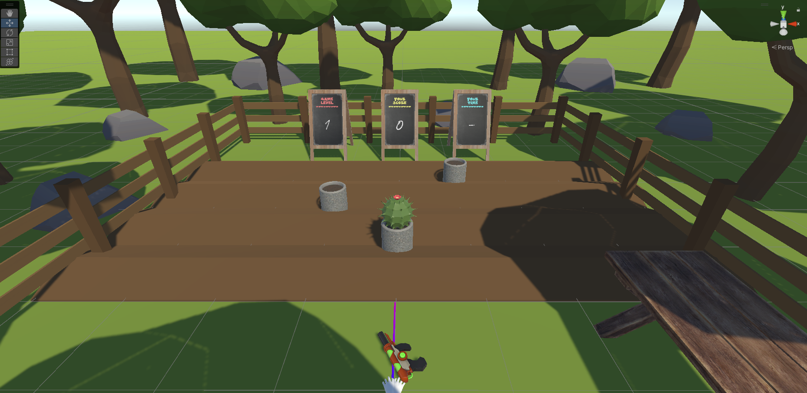
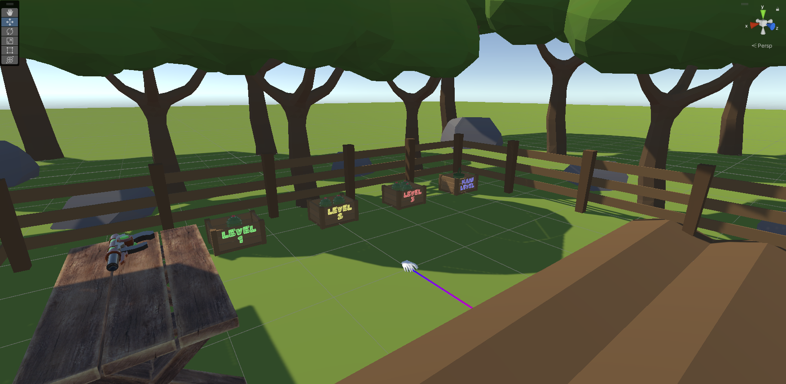
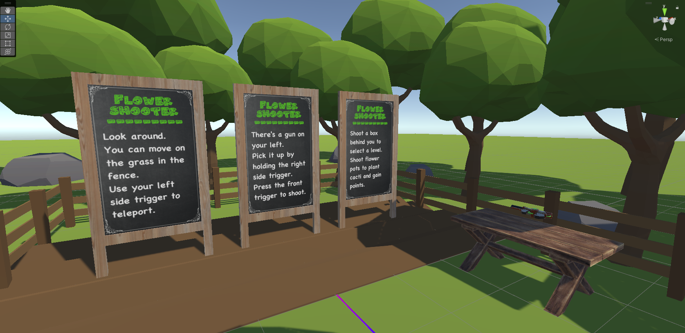

# CS4240-Lab-2

**Please create your own scene to implement your function.**

**Please put your assets into correct folders.**

**If you import any package, please mentioned in this README file.**

**Make sure there is no error before you push your code to github.**

**Pull this repository before you start your edition.**

You can download the **Github Desktop** to pull or push this repository.

## How to play

1. Teleporation: Point at the position where you want to teleport to. Press the left side trigger to teleport. You can only teleport on grass in the fences.
1. Grasping: Point at the object you want to grasp. Press and hold the right side trigger to grasp. You can only grasp the gun on the table.
1. Shooting: Press the right front trigger to shoot.
1. Level Selecting: Shoot the box behind you to select level.
1. Game Logic: Shoot the flower pots in the level and get points. In level 1 and 2, you need to shoot all flower pots. In level 3, shoot flower pots as much as possible in 1 minutes.

## Packages Imported

**VR Basic package:**

Oculus Integration (Deprecated): From asset store

**Flowerpot interaction:**

Lowpoly Flowers: From asset store

PBR_Floweringpot: From asset store

Gun models: From Taobao.com

**Scene:**
Menu Chalk Board: From asset store

Shooting Sound: From asset store

Free Casual Music Pack: From asset store

Low Poly Farm Pack Lite: From asset store

Raw Wooden Furniture Free: From asset store

## Screen Shots

You can also find a demo video in Videos folder.
